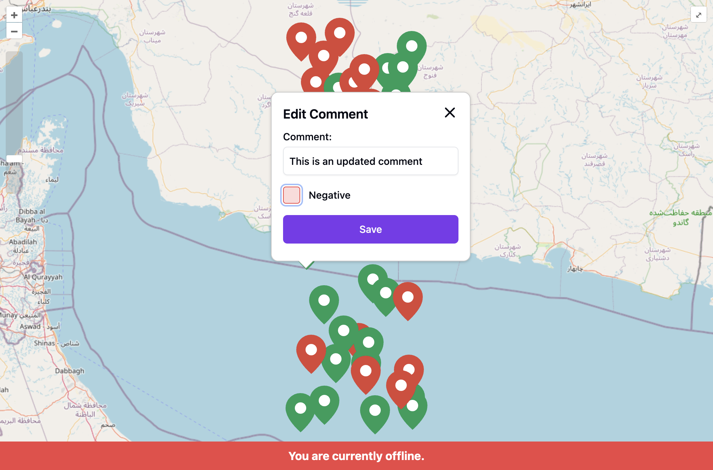

# Mini Map Application

## Overview

This project is a mini-map application built with **React**, **TypeScript**, and **Tailwind CSS**. It utilizes **OpenLayers** for rendering **OpenStreetMap**, showcasing various features and providing an adaptive front-end interface.

Live Demo: [offline-map.vercel.app](https://offline-map.vercel.app)


### Basic Commands
To install the project dependencies:
```bash
pnpm install
```
To run the project in development mode:
```bash
pnpm run dev
```

To run end-to-end tests:
```bash
pnpm run test
```

### Features Implemented

- ✅ **Map Rendering**: Utilizes OpenStreetMap through OpenLayers.
- ✅ **Zoom Controls**: Zoom in/out buttons for both desktop and mobile layouts.
- ✅ **Dynamic Points**: Displays points from sample data on the map.
- ✅ **Initial Focus**: The map focuses on the displayed points upon loading.
- ✅ **Status Indicators**: Points are marked by status using different colors.
- ✅ **Point Interaction**: Clicking on a point shows comments and allows status updates.
- ✅ **Offline Mode**: The app functions offline, allowing refresh.
- ✅ **Local Storage**: Remembers changes to status and comments.
- ✅ **PWA Support**: Configured for iOS/Android compatibility.
- ✅ **End-to-End Test**: Basic test cases to validate functionality.

### UI Shots




